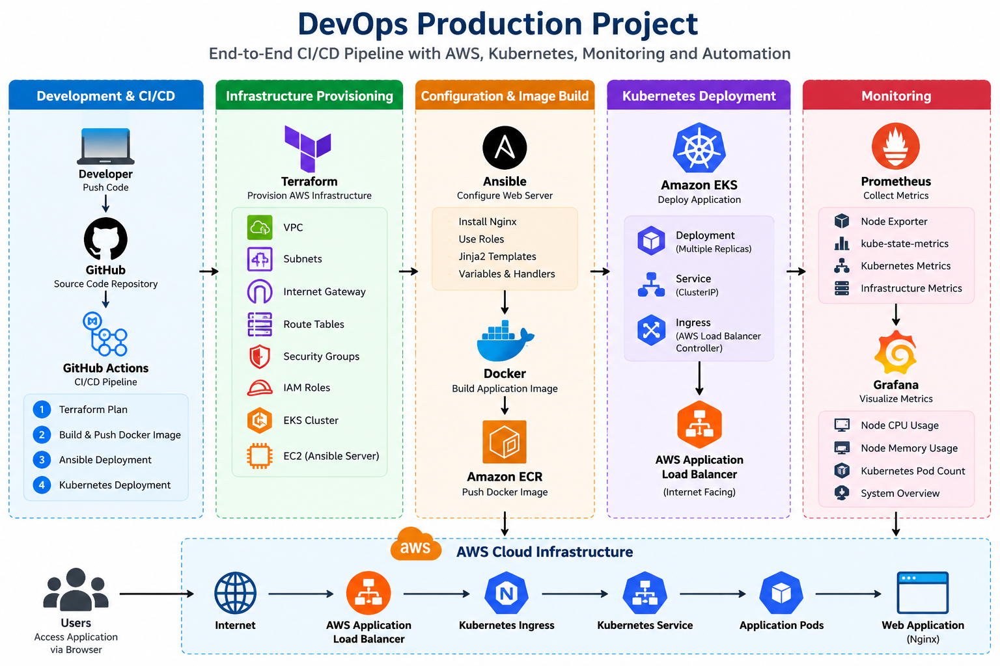

# DevOps Production Project

A complete end-to-end DevOps project demonstrating infrastructure provisioning, configuration management, containerization, Kubernetes deployment, CI/CD automation, ingress routing, and application monitoring on AWS.

## Architecture

GitHub
   ↓
GitHub Actions
   ↓
Terraform
   ↓
AWS Infrastructure
   ↓
Ansible
   ↓
Docker / Amazon ECR
   ↓
Amazon EKS
   ↓
AWS Load Balancer Controller
   ↓
Ingress
   ↓
Application
   ↓
Prometheus
   ↓
Grafana



## Technologies Used

- AWS
- Terraform
- Ansible
- Docker
- Amazon ECR
- Amazon EKS
- Kubernetes
- Kubernetes Ingress
- AWS Load Balancer Controller
- GitHub Actions
- Prometheus
- Grafana
- Linux
- Git / GitHub

## Project Components

### Terraform

Terraform provisions the AWS infrastructure required by the project, including:

- VPC
- Internet Gateway
- Public Subnets
- Route Tables
- IAM Roles
- Amazon EKS Cluster
- EKS Managed Node Group
- Ansible EC2 Server
- Security Groups

### Ansible

Ansible configures the web server using:

- Ansible Roles
- Jinja2 Templates
- Variables
- Handlers
- Nginx

### Docker

The application is packaged as a lightweight Nginx-based Docker image.

The image is pushed to Amazon ECR and deployed to Kubernetes.

### Kubernetes

The application is deployed to Amazon EKS using:

- Deployment
- Service
- Ingress

The application runs with multiple replicas for availability.

### Ingress

The AWS Load Balancer Controller creates an internet-facing Application Load Balancer.

Traffic flow:

Client → AWS ALB → Kubernetes Ingress → Service → Pods

### Monitoring

The Kubernetes environment is monitored using:

- Prometheus
- Grafana
- kube-state-metrics
- Node Exporter

The Grafana dashboard monitors:

- Node CPU Usage
- Node Memory Usage
- Kubernetes Pod Count

## CI/CD Pipeline

GitHub Actions automates the deployment workflow.

The pipeline contains four jobs:

1. Terraform Plan
2. Build and Push Docker Image
3. Ansible Deployment
4. Kubernetes Deployment

Jobs execute sequentially using GitHub Actions job dependencies.

## Repository Structure

```text
.
├── app/
│   └── index.html
├── ansible/
│   ├── inventory.ini
│   ├── site.yml
│   └── roles/
│       └── nginx/
├── k8s/
│   ├── deployment.yaml
│   ├── service.yaml
│   └── ingress.yaml
├── terraform/
│   └── main.tf
├── Dockerfile
├── .gitignore
└── README.md

Deployment Flow
Code is pushed to the main branch.
GitHub Actions starts the production workflow.
Terraform validates the AWS infrastructure configuration.
Docker builds the application image.
The image is pushed to Amazon ECR.
Ansible configures the web server.
Kubernetes deploys the application to Amazon EKS.
Kubernetes Ingress exposes the application through an AWS Application Load Balancer.
Prometheus collects infrastructure and Kubernetes metrics.
Grafana visualizes the monitoring data.
Result

The application was successfully deployed through the complete DevOps workflow and verified through the AWS Load Balancer.

The GitHub Actions production workflow successfully completed:

Terraform Plan
Docker Build and Push
Ansible Deployment
Kubernetes Deployment
What This Project Demonstrates

This project demonstrates practical experience with:

Infrastructure as Code
Cloud infrastructure
Configuration management
Containerization
Container registries
Kubernetes orchestration
Kubernetes networking
CI/CD pipelines
AWS IAM and OIDC
Infrastructure monitoring
Production-style deployment workflows
